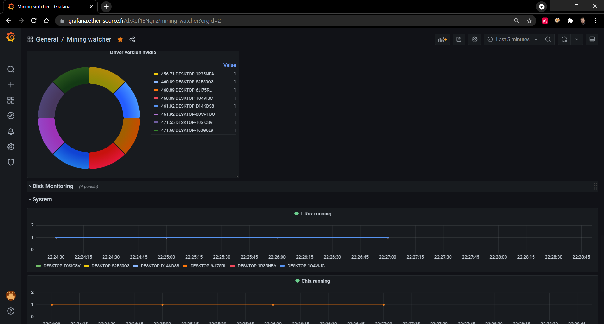

# Le launcher LFDM
## Ce petit soft en python regroupe plusieurs utilitaires.
Mais avant tout, un petit peu de lecture pour comprendre de quoi on parle.

### Grafana c'est quoi ?

Grafana est un outils que nous mettons à disposition. Il va vous permettre de visualiser vos resultat d'une manière graphique. Les resultats y seront stocké plusieurs **heures/jours/mois**, cela reste à definir.

Les données sont stocké dans une sorte de base de données qui s'apelle elasticsearch.

### Elasticsearch c'est quoi ?

Elasticsearch est une sorte de base de données que nous utilisons pour stocker les métriques et données que grafana va lire.

### Telegraf c'est quoi ?

Telegraf est ce que l'on apelle un collecteur. Il permet de recolter des informations de métrologies ou des informations custom.
Nous l'utilisons pour récuperer les métriques systeme / chia / T-rex. Tout est gerée via un templates. 

## Le plot check

L'onglet plot check permet donc de lancer la commande plot check (vous n'avez qu'a chercher votre executable chia pour se faire). Vous aurez le resultats en local dans le launcher, mais aussi sur Le [grafana de l'equipe LFDM](https://grafana.ether-source.fr/d/oQbtWaInk/plot-check?orgId=6&refresh=30s) est donc à cette adresse. 

Pour lancer le plot check, vous avez besoin de faire deux choses:
 * Ajouter votre chemin du binaire chia. Il se trouve en general ici : ``C:\Users\%UserProfile%\AppData\Local\chia-blockchain\app-1.2.2\resources\app.asar.unpacked\daemon\chia.exe``. Ma version de chia est 1.2.2, il va falloir mettre la votre dans le path.
 * Mettre un Pseudo afin de retrouver votre resultat sur grafana.

[

## La partie telegraf

La partie télégraf permet simplement de générer un template valide pour le collecteur télégraf, ainsi qu'une pre configuration pour pourvoir ecrire dans les elasticsearchs LFDM.
Afin de le faire fonctionner, vous devez vous rapprocher de nous afin d'obtenir les identifians nécéssaire.

Une partie automatisé arriveras plus tard.

## La partie Farmer

Cette partie est en cours de developemment, mais l'idée est de pouvoir vous permettre de lancer un harvester chia depuis ici, sans pour autant avoir chia de lancé.

## Des examples de graphique que nous faisons

### Supervision pool 2miners

### Supervision system

### Plot check

### Chia Monitoring

